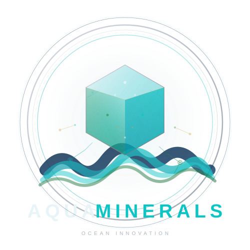

# 🌊 AquaMinerals

<p align="center">
  
</p>

<h3 align="center">
Transformando a riqueza do oceano em inovação sustentável.
</h3>

<p align="center">
Uma plataforma tecnológica criada para demonstrar como a inovação, inteligência artificial e análise de dados podem contribuir para um futuro sustentável através do uso inteligente dos recursos oceânicos.
</p>


---

# 📌 Sobre o Projeto

## Visão Geral

O **AquaMinerals** é uma plataforma digital voltada para apresentar uma visão inovadora sobre a utilização sustentável dos recursos minerais presentes nos oceanos.

O projeto une tecnologia, sustentabilidade e análise inteligente de dados para demonstrar como soluções modernas podem auxiliar no desenvolvimento econômico sem comprometer o equilíbrio ambiental.

A proposta central é mostrar que o oceano pode representar uma fonte estratégica de recursos quando explorado através de tecnologias responsáveis, monitoramento inteligente e processos sustentáveis.

---

# 🌎 Contexto e Problema

Os oceanos possuem uma enorme quantidade de recursos naturais essenciais para diversas áreas da sociedade moderna.

Entretanto, a exploração desses recursos historicamente apresenta desafios relacionados a:

- Impactos ambientais;
- Falta de monitoramento adequado;
- Uso ineficiente de dados;
- Dificuldade na tomada de decisões;
- Necessidade de tecnologias mais sustentáveis.


O AquaMinerals surge como uma proposta tecnológica para demonstrar como a informação, inteligência artificial e análise de dados podem contribuir para uma exploração mais consciente.


---

# 💡 Solução Proposta

O projeto apresenta uma plataforma interativa capaz de:

- Apresentar informações sobre minerais oceânicos;
- Demonstrar tecnologias sustentáveis;
- Exibir dados e indicadores;
- Disponibilizar uma experiência interativa através de inteligência artificial;
- Facilitar o entendimento sobre o potencial dos recursos marítimos.


---

# 🎯 Objetivos do Projeto

## Objetivo Principal

Criar uma experiência digital moderna que demonstre como tecnologia e sustentabilidade podem trabalhar juntas para gerar inovação.


## Objetivos Específicos

- Divulgar conhecimento sobre recursos minerais oceânicos;
- Demonstrar aplicações tecnológicas sustentáveis;
- Utilizar inteligência artificial como ferramenta de interação;
- Criar uma experiência visual moderna e intuitiva;
- Apresentar dados de maneira acessível;
- Incentivar discussões sobre desenvolvimento sustentável.


---

# 🚀 Funcionalidades

## 🌊 Apresentação do Projeto

A plataforma apresenta:

- Conceito do AquaMinerals;
- Objetivos ambientais;
- Proposta tecnológica;
- Benefícios da utilização sustentável dos oceanos.


---

# 📊 Dashboard

O dashboard representa uma área destinada à visualização inteligente de informações.

Possibilita apresentar:

- Dados organizados;
- Indicadores;
- Informações ambientais;
- Elementos visuais interativos.


O objetivo é transformar informações complexas em uma experiência simples e compreensível.


---

# 🗺️ Visualização Geográfica

A plataforma utiliza elementos visuais para representar informações relacionadas ao ambiente oceânico.

A visualização permite:

- Melhor compreensão espacial;
- Representação de áreas;
- Organização dos dados apresentados.


---

# 🤖 Aqua AI

## Inteligência Artificial Integrada

O Aqua AI é um assistente inteligente integrado à plataforma.

Sua função é permitir uma interação mais dinâmica entre usuário e sistema.


O usuário pode realizar perguntas relacionadas ao projeto e receber respostas utilizando uma interface conversacional.


---

## Como funciona

Fluxo de interação:

1. Usuário seleciona uma pergunta ou envia uma dúvida;
2. A plataforma processa a solicitação;
3. A inteligência artificial interpreta o contexto;
4. A resposta é apresentada dinamicamente ao usuário.


---

## Benefícios

- Maior interatividade;
- Experiência personalizada;
- Facilidade de acesso às informações;
- Melhor apresentação do projeto.


---

# 🎨 Interface e Experiência do Usuário

A plataforma foi desenvolvida buscando:

- Design moderno;
- Navegação intuitiva;
- Responsividade;
- Organização visual;
- Facilidade de entendimento.


O objetivo é permitir que tanto usuários técnicos quanto pessoas sem conhecimento em programação consigam compreender a proposta.


---

# 📱 Responsividade

O projeto foi desenvolvido pensando em diferentes dispositivos:

- Computadores;
- Notebooks;
- Tablets;
- Smartphones.


A interface adapta seus elementos para oferecer uma experiência consistente.


---

# 🔗 QR Code Interativo

O projeto possui um QR Code personalizado para facilitar o acesso à plataforma.

Ao realizar a leitura através de um dispositivo móvel, o usuário é direcionado diretamente ao ambiente oficial do AquaMinerals.


Características:

- Acesso rápido;
- Identidade visual personalizada;
- Facilidade para apresentações;
- Integração entre ambiente físico e digital.


---

# 🏗️ Arquitetura do Projeto

O AquaMinerals segue uma organização moderna de desenvolvimento de software.


## Front-End

Responsável pela:

- Interface visual;
- Interações do usuário;
- Componentes da aplicação;
- Experiência de navegação.


## Back-End

Responsável por:

- Regras de negócio;
- Processamento de informações;
- Comunicação com serviços;
- Gerenciamento de dados.


## Banco de Dados

Responsável pela:

- Persistência das informações;
- Organização dos dados;
- Estruturação das entidades.


---

# 🛠️ Tecnologias Utilizadas

## Front-End

Tecnologias utilizadas:

- HTML5
- CSS3
- JavaScript
- React
- TypeScript


Responsáveis por criar uma aplicação moderna, dinâmica e responsiva.


---

## Back-End

Tecnologias utilizadas:

- Node.js
- APIs REST
- Serviços backend


Responsáveis pelo processamento e gerenciamento das funcionalidades da aplicação.


---

## Inteligência Artificial

Recursos utilizados:

- Integração com inteligência artificial;
- Processamento de perguntas;
- Respostas automatizadas;
- Interação conversacional.


---

## Ferramentas e Desenvolvimento

- Git
- GitHub
- VS Code
- Gerenciamento de versões
- Organização modular de código


---

# 📂 Estrutura do Projeto

Exemplo de organização:

```
AquaMinerals
│
├── frontend
│   ├── components
│   ├── pages
│   ├── assets
│   └── styles
│
├── backend
│   ├── controllers
│   ├── services
│   ├── routes
│   └── database
│
├── README.md
└── documentação
```


---

# ⚙️ Instalação do Projeto

## Pré-requisitos

Necessário possuir:

- Node.js instalado;
- Gerenciador de pacotes npm ou equivalente;
- Git instalado.


---

## Clonar o projeto

```bash
git clone URL_DO_REPOSITORIO
```


---

## Instalar dependências

Frontend:

```bash
cd frontend

npm install
```


Backend:

```bash
cd backend

npm install
```


---

# ▶️ Executando o Projeto

Frontend:

```bash
npm run dev
```


Backend:

```bash
npm run dev
```


Após iniciar os serviços, acessar através do navegador.


---

# 🔐 Segurança

O projeto considera boas práticas como:

- Organização de responsabilidades;
- Controle de acesso;
- Validação de informações;
- Separação entre camadas.


---

# 🌱 Impacto Sustentável

O AquaMinerals representa uma visão de futuro onde:

- Tecnologia auxilia a preservação ambiental;
- Dados ajudam na tomada de decisões;
- Inteligência artificial amplia o acesso ao conhecimento;
- Desenvolvimento econômico pode caminhar junto com sustentabilidade.


---

# 🏆 Diferenciais do Projeto

Principais diferenciais:

✅ Integração entre tecnologia e sustentabilidade;

✅ Inteligência artificial aplicada;

✅ Experiência interativa;

✅ Visualização de informações;

✅ Identidade visual própria;

✅ Aplicação moderna e responsiva;

✅ Proposta alinhada aos desafios ambientais atuais.


---

# 👥 Equipe

Projeto desenvolvido com foco em inovação tecnológica e sustentabilidade.


---

# 📜 Licença

Este projeto possui finalidade educacional e demonstrativa.

Todos os direitos reservados aos seus respectivos autores.


---

# 🌊 AquaMinerals

**Transformando conhecimento, tecnologia e sustentabilidade em inovação para o futuro.**